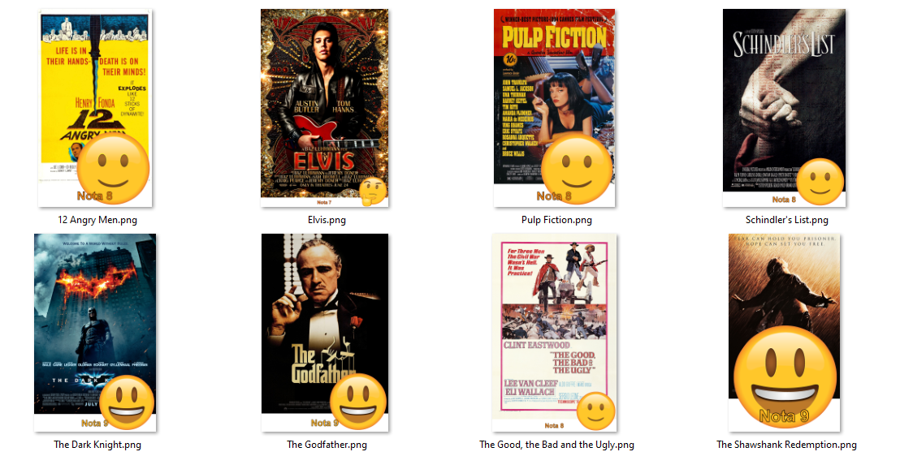

# IMERSÃO JAVA - Alura

Repositorio dos conteúdos abordados durante o curso IMERSÃO JAVA da Alura entre os dias 27/03 à 31/03.

***

## ⚪ Conteúdo

***

**Aula 01** - Consumindo uma API de filmes com Java  
**Aula 02** - Gerando figurinhas para WhatsApp  
**Aula 03** - Ligando as pontas, refatoração e orientação a objetos  
**Aula 04** - Criando nossa própria API com Spring  
**Aula 05** - Publicando nossa API no Cloud  

***

## ⚪ Descrição

***

### ✅ **Aula 01 - Consumindo uma API de filmes com Java**

Nesta primeira aula, vamos construir uma aplicação do zero para consumir a API do IMDb e exibir os filmes mais populares, destacando seus pôsteres e visualizando sua classificação sem usar nenhuma biblioteca externa.

#### **Links - 01**

Referência: [Os 250 melhores filmes de acordo com a classificação do IMDB](https://www.imdb.com/chart/top/)  
[Documentação da API do IMDB.](https://imdb-api.com/api)  
[Documentação da classe HttpRequest do pacote java.net.http](https://docs.oracle.com/en/java/javase/17/docs/api/java.net.http/java/net/http/HttpRequest.html)  
[Classe pronta que utiliza Expressões Regulares para fazer parse de um JSON](https://gist.github.com/alexandreaquiles/cf337d3bcb59dd790ed2b08a0a4db7a3)  
[Biblioteca Jackson, que faz parse de JSON](https://github.com/FasterXML/jackson)  
[Site que ajuda a entender Expressões Regulares](https://regex101.com/)  

#### **Material complementar - 01**

Artigo - [O que é JSON?](https://www.alura.com.br/artigos/o-que-e-json)  
Artigo - [Decore o terminal com cores e emojis](https://www.alura.com.br/artigos/decorando-terminal-cores-emojis)

#### **Desafios desta aula - 01**

1. Consumir o endpoint de filmes mais populares da API do IMDB.  
Procure também, na documentação da API do IMDB, o endpoint que retorna as melhores séries e o que retorna as séries mais populares.  
2. Usar sua criatividade para deixar a saída dos dados mais bonitinha: usar emojis com código UTF-8, mostrar a nota do filme como estrelinhas, decorar o terminal com cores, negrito e itálico usando códigos ANSI, e mais!  
3. Colocar a chave da API do IMDB em algum lugar fora do código como um arquivo de configuração (p. ex, um arquivo .properties) ou uma variável de ambiente.  

#### **Instabilidade da API do IMDb**

Caso a API do IMDb esteja instável ou fora do ar, você pode utilizar os seguintes endereços alternativos:

<https://raw.githubusercontent.com/alura-cursos/imersao-java-2-api/main/TopMovies.json>
<https://raw.githubusercontent.com/alura-cursos/imersao-java-2-api/main/TopTVs.json>
<https://raw.githubusercontent.com/alura-cursos/imersao-java-2-api/main/MostPopularMovies.json>
<https://raw.githubusercontent.com/alura-cursos/imersao-java-2-api/main/MostPopularTVs.json>  

#### **Resultado do Desafio - 01**

***
&nbsp;
***

### ✅ **Aula 02 - Gerando figurinhas para WhatsApp**

Nesta segunda aula vamos criar um gerador de figurinhas explorando outras bibliotecas nativas do Java, para que possamos enviar por Whatsapp os nossos filmes preferidos.

#### **Links - 02**

[Documentação javax.imageio](https://docs.oracle.com/en/java/javase/17/docs/api/java.desktop/javax/imageio/package-summary.html)  
[Documentação BufferedImage](https://docs.oracle.com/en/java/javase/17/docs/api/java.desktop/java/awt/image/BufferedImage.html)  
[Documentação classe Graphics2D](https://docs.oracle.com/en/java/javase/17/docs/api/java.desktop/java/awt/Graphics2D.html)  
[Documentação InputStream](https://docs.oracle.com/en/java/javase/17/docs/api/java.base/java/io/InputStream.html)  

#### **Material complementar - 02**

[Java Polimorfismo: entenda herança e interfaces](https://www.alura.com.br/conteudo/java-heranca-interfaces-polimorfismo)  
[Java e Orientação a Objetos](https://www.alura.com.br/apostila-java-orientacao-objetos/apendice-pacote-java-io)  

#### **Desafios desta aula - 02**

1. Criar diretório de saída das imagens, se ainda não existir.
2. Centralizar o texto na figurinha.
3. Colocar outra fonte como a Comic Sans ou a Impact, a fonte usada em memes.
4. Colocar contorno (outline) no texto da imagem.
5. Colocar uma imagem de você que está fazendo esse curso sorrindo, fazendo joinha e fazer com que o texto da figurinha seja personalizado de acordo com as classificações do IMDB.

#### **Resultado do Desafio - 02**

**Observação:** Como não existe um padrão de tamanho das imagens dos posters do filmes, da esse efeito de que as imagens dos emojis e dos textos estão mudando para cada imagem, mas estes estão padronizados.

Eu comecei a fazer uma função de redimensionar as imagens pegas na API antes de adicionar o texto e os emojis, mas não tive tempo de concluir. 😅

***
&nbsp;
***

### ⛔ **Aula 03 - Ligando as pontas, refatoração e orientação a objetos**

#### **Links - 03**

#### **Desafios desta aula - 03**

#### **Resultado do Desafio - 03**

***
&nbsp;
***

### ⛔ **Aula 04 - Criando nossa própria API com Spring**

#### **Links - 04**

#### **Desafios desta aula - 04**

#### **Resultado do Desafio - 04**

***
&nbsp;
***

### ⛔ **Aula 05 - Publicando nossa API no Cloud**

#### **Links - 05**

#### **Desafios desta aula - 05**

#### **Resultado do Desafio - 05**

***
