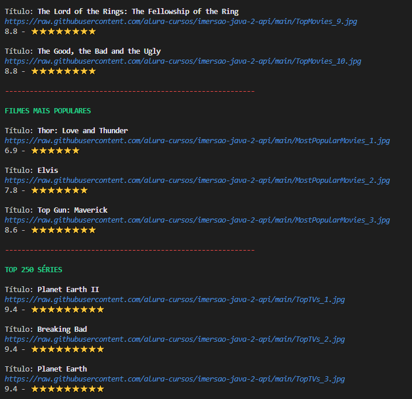

# IMERSÃO JAVA - Alura

Repositorio dos conteúdos abordados durante o curso IMERSÃO JAVA da Alura entre os dias 27/03 à 31/03.

***

## ⚪ Conteúdo

***

**Aula 01** - Consumindo uma API de filmes com Java  
**Aula 02** - Gerando figurinhas para WhatsApp  
**Aula 03** - Ligando as pontas, refatoração e orientação a objetos  
**Aula 04** - Criando nossa própria API com Spring  
**Aula 05** - Publicando nossa API no Cloud  

***

## ⚪ Descrição

***

### ✅ **Aula 01 - Consumindo uma API de filmes com Java**

Nesta primeira aula, vamos construir uma aplicação do zero para consumir a API do IMDb e exibir os filmes mais populares, destacando seus pôsteres e visualizando sua classificação sem usar nenhuma biblioteca externa.

**Links**  
Referência: [Os 250 melhores filmes de acordo com a classificação do IMDB](https://www.imdb.com/chart/top/)  
[Documentação da API do IMDB.](https://imdb-api.com/api)  
[Documentação da classe HttpRequest do pacote java.net.http](https://docs.oracle.com/en/java/javase/17/docs/api/java.net.http/java/net/http/HttpRequest.html)  
[Classe pronta que utiliza Expressões Regulares para fazer parse de um JSON](https://gist.github.com/alexandreaquiles/cf337d3bcb59dd790ed2b08a0a4db7a3)  
[Biblioteca Jackson, que faz parse de JSON](https://github.com/FasterXML/jackson)  
[Site que ajuda a entender Expressões Regulares](https://regex101.com/)  

**Material complementar**  
Artigo - [O que é JSON?](https://www.alura.com.br/artigos/o-que-e-json)  
Artigo - [Decore o terminal com cores e emojis](https://www.alura.com.br/artigos/decorando-terminal-cores-emojis)

**Desafios desta aula**  
Consumir o endpoint de filmes mais populares da API do IMDB.  
Procure também, na documentação da API do IMDB, o endpoint que retorna as melhores séries e o que retorna as séries mais populares.  
Usar sua criatividade para deixar a saída dos dados mais bonitinha: usar emojis com código UTF-8, mostrar a nota do filme como estrelinhas, decorar o terminal com cores, negrito e itálico usando códigos ANSI, e mais!  

**Instabilidade da API do IMDb**  
Caso a API do IMDb esteja instável ou fora do ar, você pode utilizar os seguintes endereços alternativos:

<https://raw.githubusercontent.com/alura-cursos/imersao-java-2-api/main/TopMovies.json>
<https://raw.githubusercontent.com/alura-cursos/imersao-java-2-api/main/TopTVs.json>
<https://raw.githubusercontent.com/alura-cursos/imersao-java-2-api/main/MostPopularMovies.json>
<https://raw.githubusercontent.com/alura-cursos/imersao-java-2-api/main/MostPopularTVs.json>  

**Resultado do Desafio**

***

### ⛔ Aula 02 - Gerando figurinhas para WhatsApp
